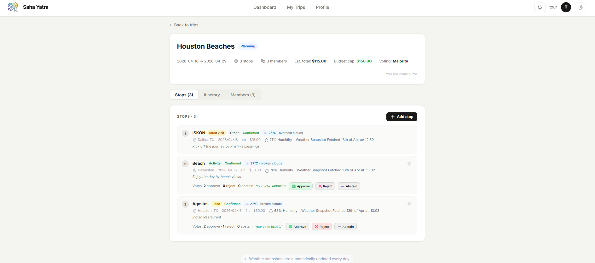

# Saha Yatra — Frontend

> **Collaborative travel route planning** — React 18 · Vite · Inter UI · Phase 1–5 complete

A full-featured React SPA for planning trips collaboratively. Members propose stops, vote on them, track weather, and view day-grouped itineraries. Connects to the [Saha Yatra Backend API](../saha-yatra-backend).

---

## Live Demo

| Resource | URL |
|---|---|
| App | `http://localhost:5173` |
| Backend API | `http://localhost:8080` |

---

## Screenshot

> Trip detail page — stops with live voting, weather snapshots, and the Itinerary tab



---

## Tech Stack

| Layer | Technology |
|---|---|
| Framework | React 18 + Vite 5 |
| Language | JavaScript (JSX) |
| Styling | Inline styles + CSS variables (`index.css`) |
| Font | Inter (Google Fonts) |
| State | React `useState` / `useCallback` / `useEffect` |
| HTTP | Native `fetch` (no Axios) |
| Auth | JWT stored in `localStorage` |
| Build | Vite |

No external component library. All UI is hand-built for full control over the design.

---

## Project Structure

```
src/
│
├── api/
│   └── client.js              # All fetch calls — single source of truth for API calls
│
├── components/
│   ├── auth/
│   │   └── AuthLeft.jsx       # Dark left panel on login/register screens
│   ├── layout/
│   │   └── Nav.jsx            # Sticky top nav with unread notification badge
│   ├── trips/
│   │   ├── TripCard.jsx       # Clickable trip card in the list view
│   │   ├── CreateTripModal.jsx# Modal form: title, dates, budget, voting mode
│   │   ├── StopsList.jsx      # Stop rows with voting buttons + weather badge
│   │   └── MembersList.jsx    # Member rows with invite form + token display
│   └── ui/
│       ├── Icons.jsx          # All SVG icons as React components
│       ├── Input.jsx          # Reusable labelled input field
│       └── Spinner.jsx        # Inline loading indicator
│
├── hooks/
│   ├── useTrips.js            # Trip list state: load, create, update, remove
│   └── useNotifications.js    # Notification state with optimistic mark-read
│
├── pages/
│   ├── LoginScreen.jsx        # Split-panel login
│   ├── RegisterScreen.jsx     # Split-panel register with profile fields
│   ├── Dashboard.jsx          # Build roadmap + quick actions + endpoint list
│   ├── Trips.jsx              # My trips / Public trips tabs
│   ├── TripDetail.jsx         # Stops · Itinerary · Members tabs
│   ├── Notifications.jsx      # All / Unread filter, mark-read, trip links
│   └── Profile.jsx            # View and edit user profile
│
├── styles/
│   └── theme.js               # Shared inline style tokens (S.card, S.btnPrimary, …)
│
├── App.jsx                    # Screen router + auth state + notification hook
├── index.css                  # Global reset, full-width #root, CSS variables
└── main.jsx                   # React entry point
```

---

## Screens

### Auth
| Screen | Route (screen state) | Description |
|---|---|---|
| Login | `login` | JWT login, redirects to dashboard on success |
| Register | `register` | Creates account with display name, bio, travel style |

### Authenticated
| Screen | Route (screen state) | Description |
|---|---|---|
| Dashboard | `dashboard` | Build progress roadmap, quick actions, live endpoint list |
| My Trips | `trips` | Browse own trips and public trips; create new trip |
| Trip Detail | `tripDetail` | Three tabs: Stops, Itinerary, Members |
| Notifications | `notifications` | All/Unread tabs, per-item and bulk mark-read |
| Profile | `profile` | View and edit display name, bio, travel style, avatar URL |

---

## Key Features

### Stops tab
- Ordered stop list with category badge, vote status, and weather snapshot inline
- Vote buttons (Approve / Reject / Abstain) with optimistic highlight of your current vote
- Live tally loaded from `GET /stops/{id}/votes`
- Add stop form (name, location, category, visit date, duration, cost, notes, must-visit flag)

### Itinerary tab
- Stops grouped by `visitDate` into day plans, sorted ascending
- "Unscheduled" bucket at the bottom for stops without a date
- Grand total estimated cost + per-category cost breakdown chips
- Each stop shows duration, cost, vote counts, and notes

### Notifications
- Real-time unread badge on the Nav bell icon
- Type-coded cards: Stop Proposed / Vote Resolved / Member Joined / Trip Status Changed
- Optimistic `markRead` — updates the UI instantly, reverts on API failure
- "Open trip" deep link navigates directly to the relevant `TripDetail`

### Voting modes
Displayed on the trip header. Trip was created with one of three modes:
- **Majority** — auto-confirms if >50% approve
- **Unanimous** — any reject auto-rejects the stop
- **Organizer** — votes are advisory; organizer uses the status override

---

## API Client

All HTTP calls live in `src/api/client.js`. The file is the single source of truth — no calls are made elsewhere.

```js
// Phase 1 — Auth
api.login(username, password)
api.register(formData)
api.getCurrentUser(token)
api.updateProfile(profileData, token)

// Phase 2 — Trips & Members
api.createTrip(data, token)
api.getMyTrips(token)
api.getPublicTrips()
api.getTripById(tripId, token)
api.addStop(tripId, data, token)
api.removeStop(tripId, stopId, token)
api.inviteMember(tripId, userId, role, token)
api.acceptInvite(inviteToken, token)
api.advanceTripStatus(tripId, token)

// Phase 3 — Voting
api.voteStop(tripId, stopId, voteType, token)
api.getStopVotes(tripId, stopId, token)

// Phase 5 — Notifications & Itinerary
api.getNotifications(token, unread)
api.markNotificationRead(notificationId, token)
api.markAllNotificationsRead(token)
api.getItinerary(tripId, token)
```

---

## Auth Flow

```
User submits login form
  → POST /auth/login
  → JWT stored in localStorage ("rw_token")
  → User object stored in localStorage ("rw_user")
  → App.jsx reads both on mount → starts authenticated

Logout
  → Clears localStorage
  → Returns to login screen

JWT passed as:  Authorization: Bearer <token>
```

---

## State Architecture

Navigation is managed with a single `screen` state string in `App.jsx` — no React Router.

```
App.jsx
 ├── token, user (localStorage-backed)
 ├── screen: "login" | "register" | "dashboard" | "trips" |
 │           "tripDetail" | "notifications" | "profile"
 ├── activeTripId (set when navigating to tripDetail)
 ├── useNotifications(token)  ← loaded once at shell level
 │     notifications, unreadCount, markRead, markAllRead
 └── renders one page component based on screen
```

Each page fetches its own data on mount. No global store (Redux/Zustand) is needed at this scale.

---

## Getting Started

### Prerequisites
- Node.js 18+
- npm or yarn
- [Saha Yatra Backend]((https://github.com/manojk-sai/SahaYatra)) running on port 8080

### 1 — Clone and install

```bash
git clone https://github.com/your-username/saha-yatra-frontend.git
cd saha-yatra-frontend
npm install
```

### 2 — Configure API base URL

The backend URL is set at the top of `src/api/client.js`:
```js
const API_BASE = "http://localhost:8080";
```
Change this for staging or production.

### 3 — Run dev server

```bash
npm run dev
```

Open `http://localhost:5173`.

### 4 — Build for production

```bash
npm run build        # outputs to dist/
npm run preview      # preview the production build locally
```

---

## Phase History

| Phase | Frontend additions |
|---|---|
| 1 | Login, Register, Dashboard, Profile |
| 2 | Trips list, Trip detail, Stops tab, Members tab, Create trip modal |
| 3 | Vote buttons per stop, live tally, vote status badges |
| 4 | Weather snapshot badge inline on each stop |
| 5 | Notifications page, bell badge in Nav, Itinerary tab with day grouping |
